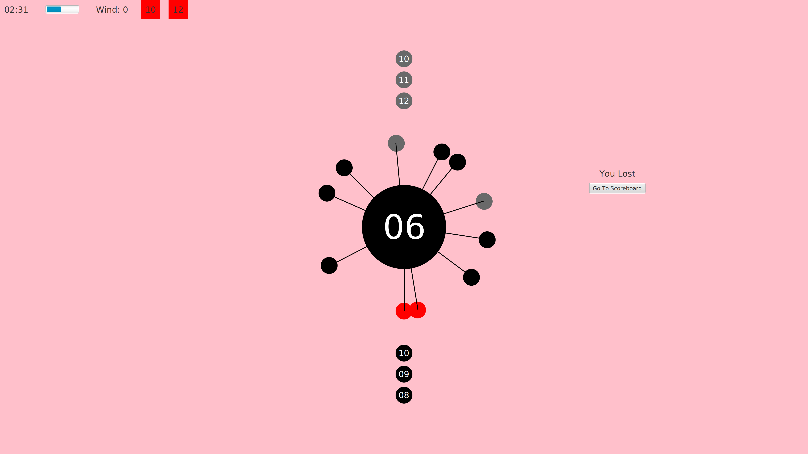
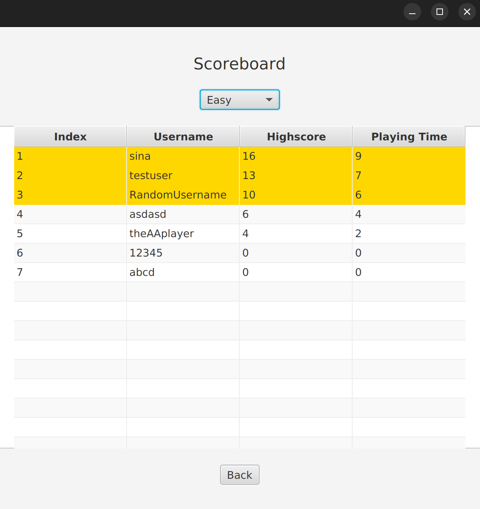
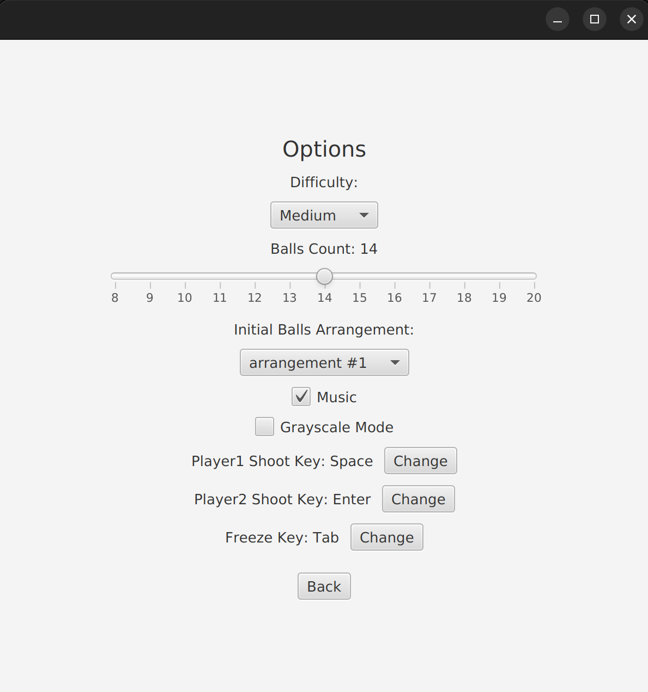
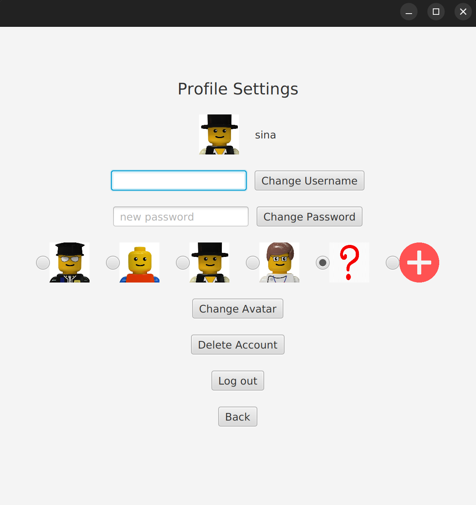

# AA Game
A graphical game written in Java similar to the popular game AA.

## Features
- Multiple user accounts
- Single player and double player modes
- Controls, difficulty, and game options customization
- Profile customization
- Scoreboard
- Slow-motion ability
- Increased complexity based on progress (rotation reversal, invisible balls, wind speed, changing ball radius, etc.)

## Screenshots

*Gameplay*

*Game Screen*

*Scoreboard*

*Options Menu*

*Profile Menu*
